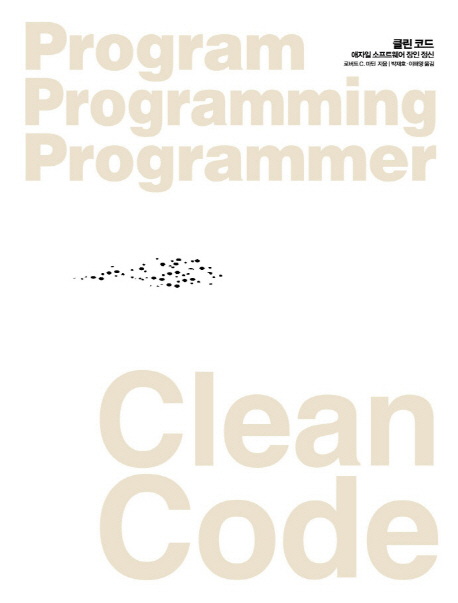

# 07. 오류처리
- 오류 처리는 프로그램에 반드시 필요한 요소 중 하나
- 뭔가 잘못 될 가능성이 늘 존재하기 때문
- 그렇기 때문에 오류 처리는 중요하지만 오류 처리 코드 때문에 프로그램 논리를 이해하기 어려워질 수 있음
- 이번 7장에서 우아하고 고상하게 오류를 처리하는 기법과 고려 사항 몇 가지를 소개

## 오류 코드보다 예외를 사용하라
```java
public class DeviceController {
	...
	public void sendShutDown() {
		DeviceHandle handle = getHandle(DEV1);
		// 디바이스 상태를 점검한댜.
		if (handle != DeviceHandle.INVALID) {
			// 레코드 필드에 디바이스 상태를 저장한다.
			retrieveDeviceRecord(handle);
			// 디바이스가 일시정지 상태가 아니라면 종료한다.
			if (record.getStatus() != DEVICE_SUSPENDED) {
				pauseDevice(handle);
				clearDeviceWorkQueue(handle);
				closeDevice(handle);
			} else {
				logger.log("Device suspended. Unable to shut down");
			}
		} else {
			logger.log("Invalid handle for: " + DEV1.toString());
		}
	}
	...
}
``` 
- 위와 같은 방법을 사용하면 호출자 코드가 복잡해짐
- 함수를 호출한 즉시 오류를 확인해야 하기 때문

그래서 아래 예시처럼 오류 발생 시 예외를 던지는 편이 더 좋다.  
그러면 호출자 코드가 더 깔끔해진다.
```java
public class DeviceController {
	...
	public void sendShutDown() {
		try {
			tryToShutDown();
		} catch (DeviceShutDownError e) {
			logger.log(e);
		}
	}

	private void tryToShutDown() throws DeviceShutDownError {
		DeviceHandle handle = getHandle(DEV1);
		DeviceRecord record = retrieveDeviceRecord(handle);
		pauseDevice(handle); 
		clearDeviceWorkQueue(handle); 
		closeDevice(handle);
	}

	private DeviceHandle getHandle(DeviceID id) {
		...
		throw new DeviceShutDownError("Invalid handle for: " + id.toString());
		...
	}
	...
}
```

## Try-Catch-Finally 문부터 작성하라
- try 블록에서 무슨 일이 생기든지 catch 블록은 프로그램 상태를 일관성 있게 유지해야 한다.
- try-catch-finally 문을 시작으로 코드를 짜면 호출자가 기대하는 상태를 정의하기 쉬워진다.

다음은 파일이 없으면 예외를 던지는지 알아보는 단위 테스트 코드 예시이다.

```java
 @Test(expected = StorageException.class)
 public void retrieveSectionShouldThrowOnInvalidFileName() {
     sectionStore.retrieveSection("invalid - file");
 }
```

단위 테스트에 맞춰 다음 코드를 구현했다.
```java
 public List<RecordedGrip> retrieveSection(String sectionName) {
     // 실제로 구현할 때까지 비어 있는 더미를 반환한다.
     return new ArrayList<RecordedGrip>();
 }
```
그런데 위 코드가 예외를 던지지 않으므로 단위 테스트는 실패한다.
파일 접근을 시도하도록 구현을 변경하자.
```java
 public List<RecordedGrip> retrieveSection(String sectionName) {
     try {
         FileInputStream stream = new FileInputStream(sectionName);
     } catch (Exception e) {
         throw new StorageException("retrieval error", e);
     }
     return new ArrayList<RecordedGrip>();
 }
```
이제는 테스트가 성공한다. 이렇게 변경하면 아래처럼 리팩토링까지 가능해진다.
```java
 public List<RecordedGrip> retrieveSection(String sectionName) {
     try {
         FileInputStream stream = new FileInputStream(sectionName);
         stream.close();
     } catch (FileNotFoundException e) {
         throw new StorageException("retrieval error", e);
     }
     return new ArrayList<RecordedGrip>();
 }
```

## 미확인(unchecked) 예외를 사용하라
- 대규모 시스템에서 호출이 일어나는 방식을 상상해보자.
- 최상위 함수가 아래 함수를 호출하고 아래 함수는 그 아래 함수를 호출한다.
- 단계를 내려갈수록 호출하는 함수 수는 늘어난다. 최하위 함수를 변경해 새로운 오류를 던진다고 가정한다면, 변경한 함수를 호출하는 함수 모두가 새로운 예외를 처리해야 하는 연쇄적인 수정이 일어난다.
- 모든 함수가 최하위 함수에서 던지는 예외를 알아야 하므로 캡슐화가 깨진다.
- 그러므로 무조건 확인된 예외 뿐 아니라 미확인 예외도 확인해야 한다.

## 예외에 의미를 제공하라
- 예외를 던질 때는 전후 상황을 충분히 덧붙인다.
- 오류 메시지에 정보를 담아 예외와 함께 던진다.
- 실패한 연산 이름과 실패 유형도 언급해준다.
- 애플리케이션이 로깅 기능을 사용한다면 catch 블록에서 오류를 기록하도록 충분한 정보를 넘겨준다.

## 호출자를 고려해 예외 클래스를 정의하라
- 오류를 정의할 때 프로그래머에게 가장 중요한 관심사는 오류를 잡아내는 방법이 되어야 한다.
- 예외 클래스가 하나만 있어도 충분한 코드가 많다.
- 한 예외는 잡아내고 다른 예외는 무시해도 괜찮은 경우라면 여러 예외 클래스를 사용한다.

## null을 반환하지마라
- null을 반환하고픈 유혹이 든다면 그 대신 예외를 던지거나 특수 사례 객체를 반환한다

## null을 전달하지 마라
- 메서드로 null을 전달하는 방식은 더 나쁘다. 최대한 피한다.

## 결론
- 깨끗한 코드는 읽기도 좋아야 하지만 안정성도 높아야 한다.
- 오류 처리를 프로그램 논리와 분리해 독자적인 사안으로 고려하면 튼튼하고 깨끗한 코드를 작성할 수 있다.
