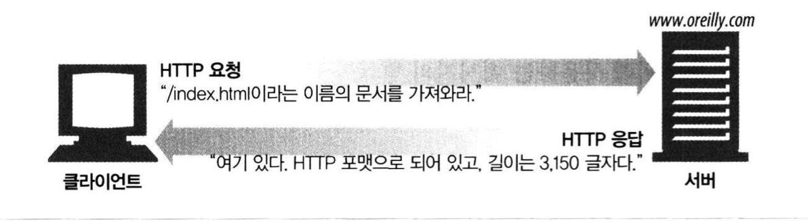
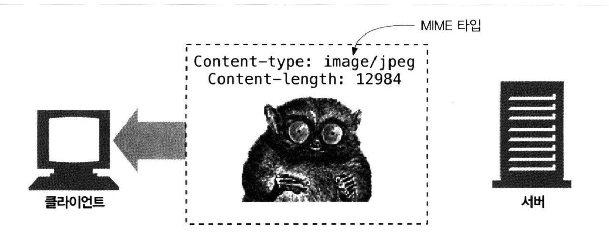
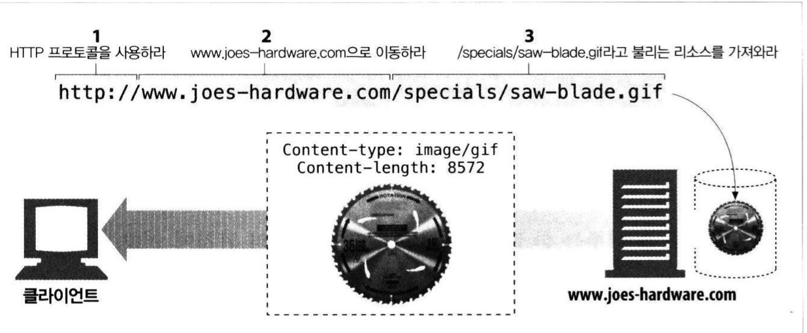
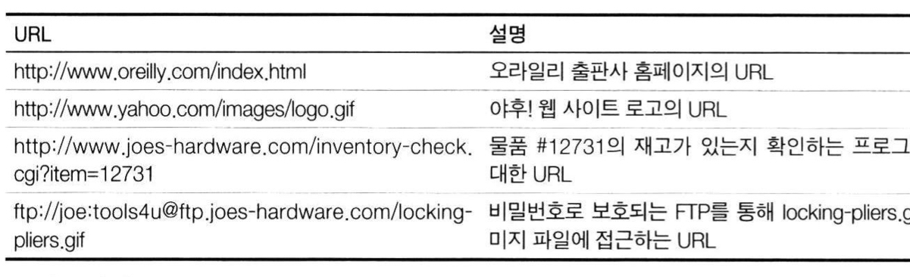
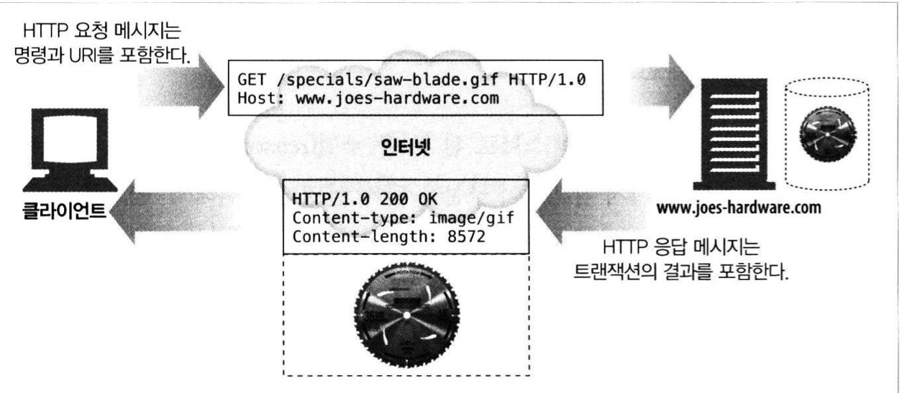
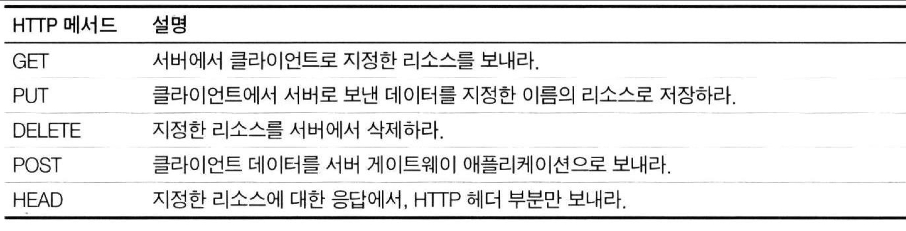
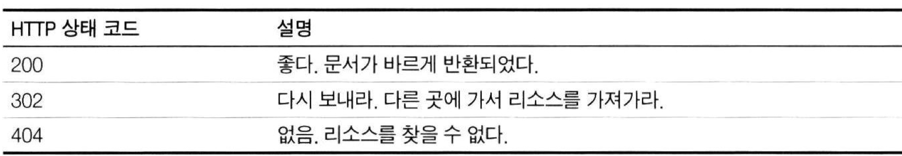
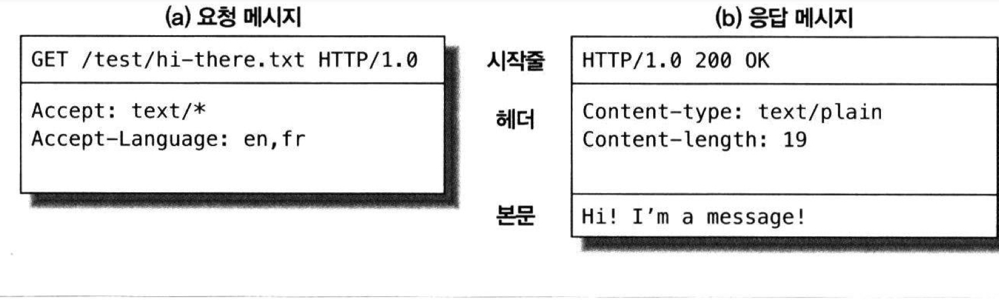
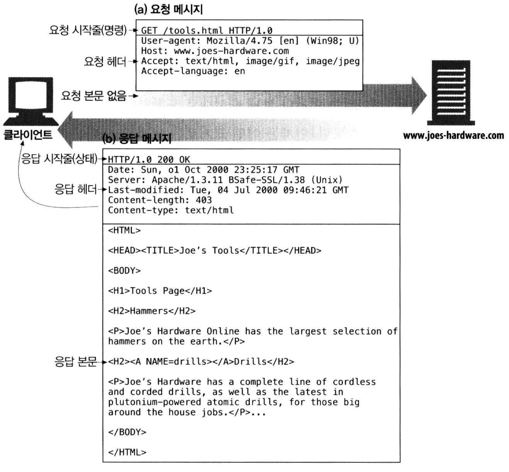
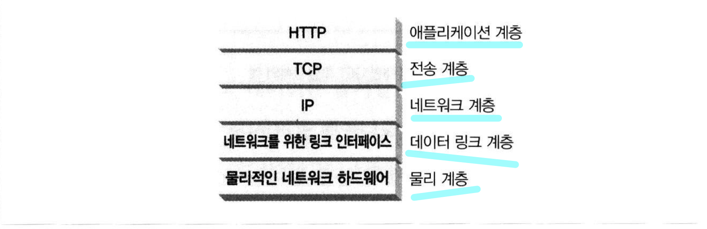

# Ch01. HTTP 개관

## 1.1 HTTP: 인터넷의 멀티미디어 배달부

- HTTP는 전 세계의 웹 서버로부터 수십억 개의 JPEG 이미지, HTML 페이지, 텍스트 파일, MPEG 동영상, WAV 음성 파일, 자바 애플릿 등 이러한 대량의 정보를 빠르고, 간편하고, 정확하게 사람들의 PC에 설치된 "브라우저" 로 옮겨준다.
- HTTP는 신뢰성 있는 데이터 전송 프로토콜을 사용하기 때문에, 이러한 과정에서 데이터가 손상되거나 꼬이거나 하는것을 걱정하기 않아도 된다.
- 이 때문에 개발자는 이것들에 관해서 걱정하지 않고 온전이 애플리케이션의 고유한 기능을 구현하는데에 집중할 수 있다.

## 1.2 웹 클라이언트와 서버

- 보통 HTTP 요청과 응답은 아래 그림처럼 이루어진다.

1. 클라이언트가 웹 서버로 HTTP 요청을 보낸다.
2. 웹 서버는 요청된 데이터를 HTTP 응답으로 돌려준다.
   

- 우리는 평소에 매일과 같이 HTTP 클라이언트를 이용하고 있다.
- www.naver.com 페이지를 열어볼 때, 웹 브라우저는 HTTP 요청을 www.naver.com 서버로 보낼 것이고 우리는 그 HTTP 응답 데이터를 브라우저에서 확인할 수 있다.

## 1.3 리소스

- 웹 서버는 웹 리소스를 관리하고 제공한다.
- 웹 리소스는 웹 콘텐츠의 원천
- 가장 단순한 웹 리소스는 웹 서버 파일 시스템의 정적 파일(텍스트 파일, HTML 파일, 마이크로소프트 워드 파일, 어도비 아크로뱃 파일, JPEG 이미지 파일, AVI 동영상 파일 등)
- 그러나 리소스는 반드시 정적 파일이어야 할 필요는 없다.
- 주식 거래 데이터, 부동산 데이터베이스 검색, 온라인 쇼핑몰에서 선물 구입 등 리소스는 요청에
  따라 콘텐츠를 생산하는 프로그램이 될 수도 있다.

### 1.3.1 미디어 타입

- 인터넷은 수천 가지 데이터 타입을 다루기 때문에, HTTP는 이들의 관리를 위해 웹에서 전송되는 객체 각각에 MIME(Multipurpose Internet Mail Extensions) 타입이라는 데이터 포멧 "라벨"을 붙인다.
- 이름에서도 알 수 있듯이 원래 전자메일 시스템에서 이용하던 것이였으나, HTTP에서도 멀티미디어 콘텐츠를 기술하고 관리하기 위해 이 라벨을 붙이고자 채택 되었다.
- HTTP가 이 MIME타입을 통해 다룰 수 있는 객체인지 확인한다. [MDN MIME타입](https://developer.mozilla.org/ko/docs/Web/HTTP/Basics_of_HTTP/MIME_types) 에서 MIME 타입에 대해 확인 가능하다.



- HTML로 작성된 텍스트 문서는 text/html 라벨이 붙는다.
- plain ASCII 텍스트 문서는 text/plain 라벨이 붙는다.
- JPEG 이미지는 image/jpeg가 붙는다.
- GIF 이미지는 image/gif가 된다.  
  etc...

### 1.3.2 URI

- 웹 서버 리소스는 각자 이름을 갖고 있다.
- 서버 리소스 이름은 통합 자원 식별자(uniform resource identifier, URI) 로 불린다. 인터넷의 우편물 주소 같은 것

아래 그림은 URI가 HTTP 프로토콜에서 어떻게 해석되는지 보여주는 예  


- URI에는 URL (uniform resource locator), URN(Uniform Resource Name) 두 가지가 있지만 오늘날에는 대부분 URI가 URL이다.

### 1.3.3 URL

- URL은 리소스 식별자의 가장 흔한 형태.
- URL은 특정 서버의 한 리소스에 대한 구체적인 위치를 서술한다.
- URL은 리소스가 정확히 어디에 있고 어떻게 접근할 수 있는지 분명히 알려준다.



- 첫번째 부분은 스킴이라고 불리는데, 리소스에 접근하기 위해 사용되는 프로토콜을 서술한다. 보통 HTTP 프로토콜(http://)이다.
- 두번째 부분은 서버의 인터넷 주소를 제공한다(예: www.naver.com)
- 마지막은 웹 서버의 리소스를 가리킨다.(예: /specials/saw-blade.gif)

### 1.3.4 URN

- URN, 유니폼 리소스 이름은 콘텐츠를 이루는 한 리소스에 대해, 그 리소스의 위치에 영향 받지 않는 유일무이한 이름 역할을 한다.
- URN은 현재 실험중인 상태고 널리 채택되지는 않았다.

## 1.4 트랜잭션

- HTTP 트랜잭션은 요청 명렁과 응답 결과로 구성되어 있다.
- 이 상호 작용은 아래 그림에서 확인할 수 있다.
- 상호작용은 HTTP 메세지라고 불리는 정형화된 데이터 덩어리를 이용해 이루어진다.



### 1.4.1 메서드

- HTTP는 HTTP 메서드라고 불리는 여러 가지 종류의 요청 명령을 지원한다.



### 1.4.2 상태코드

- 모든 HTTP 응답 메시지는 아래와 같은 상태 코드와 함께 반환된다.
- 상태 코드는 클라이언트에게 요청이 성공했는지 추가 조치가 필요한지 알려주는 세자리 숫자이다.
- HTTP는 각 숫자 상태 코드에 텍스트로 된 "사유 구절" 도 함께 보낸다.

```http
200 OK
200 Document attached
200 Success
200 All's cool, dude
```

### 1.4.3 웹페이지는 여러 객체로 이루어질 수 있다.

- 애플리케이션은 보통 하나의 작업을 수행하기 위해 여러 HTTP 트랜잭션을 수행한다.
- 예를 들어, 웹 브라우저는 페이지 레이아웃을 서술하는 HTML "뼈대"를 한 번의 트랜잭션으로 가져온 뒤, 첨부된 이미지, 그래픽 조각, 자바 애플릿 등을 가져오기 위해 추가로 HTTP 트랜잭션들을 수행한다.
- "웹 페이지" 는 보통 하나의 리소스가 아닌 리소스의 모음.



## 1.5 메시지

- HTTP 메시지에 대해서 알아보자.
- 클라이언트에서 서버로 가능 HTTP 메시지를 요청 메시지라고 부른다.
- 서버에서 클라이언트로 가는 메시지는 응답 메시지라고 부른다.
- 메시지는 다음의 세 부분으로 이루어진다.



> 시작줄  
> 메시지의 첫 줄은 시작줄로, 요청이라면 무엇을 해야 하는지 응답이라면 무슨 일이 일어났는지 나타낸다.

> 헤더  
> 0개 이상의 헤더 필드가 이어진다. 헤더는 빈줄로 끝난다.

> 본문  
> 요청의 본문은 웹 서버로 데이터를 실어 보내며, 응답의 본문은 클라이언트로 데이터를 반환한다. 문자열이며 구조적인 시작줄이나 헤더와 달리, 본문은 임의의 이진 데이터를 포함할 수 있다.(이미지, 비디오, 오디오 트랙, 응용 소프트웨어, 텍스트)



## 1.6 TCP 커넥션

- TCP (Transmission Control Protocol, 전송 제어 프로토콜) 커넥션을 통해 메시지가 한 곳에서 다른곳으로 옮겨갈 수 있다.

### 1.6.1 TCP/IP

- 먼저 HTTP는 애플리케이션 계층 프로토콜로, HTTP는 네트워크 통신의 핵심적인 세부사항에 대해 신경쓰지 않는다. 이를 TCP/IP 에게 맡긴다.
- TCP/IP는 오류 없는 데이터를 전송하도록 하고, 순서에 맞는 전달을 하도록 하고, 언제든 어떤 크기로든 데이터를 보낼 수 있다.
- 때문에 일단 TCP 커넥션이 맺어지면, 클라이언트와 서버 컴퓨터 간에 교환되는 메시지가 없어지거나, 손상되거나, 순서가 뒤바뀌어 수신되는 일은 결코 없다.
- TCP/IP는 TCP와 IP가 층을 이루는, 패킷 교환 네트워크 프로토콜의 집합



### 1.6.2 접속, IP 주소 그리고 포트번호

- 인터넷 프로토콜(IP) 주소와 포트번호를 사용해 클라이언트와 서버 사이에 TCP/IP 커넥션을 맺는다.
- TCP 커넥션을 맺는 것은 다른 회사 사무실에 있는 누군가에게 전화를 거는것과 비슷
- 그렇다면 우리는 포트번호를 어떻게 알 수 있을까? 앞에서 얘기했듯 URL이란 리소스에 대한 주소라고 했듯이 URL 명시되어 있다.

```
http://20.200.83.29:80/index.html
http://www.netscape.com:80/index.html
http://www.netscape.com/index.html
```

- 두번째는 IP 주소 대신 호스트명이 적혀있는데, IP 주소에 대한 이애하기 쉬운 형태의 별명이라고 볼 수 있다. 호스트명은 도메인 이름 서비스라 불리는 DNS 를 통해 쉽게 IP로 변환될 수 있다.
- 세번째는 포트번호가 없는데 포트번호가 없을 때 기본값은 80이라고 가정한다.
- 커넥션 순서는 다음과 같다.

(a) 웹브라우저는 서버의 URL에서 호스트 명을 추출한다.  
(b) 웹브라우저는 서버의 호스트 명을 IP로 변환한다.  
(c) 웹브라우저는 URL에서 포트번호(있다면) 를 추출한다.  
(d) 웹브라우저는 웹 서버와 TCP 커넥션을 맺는다.  
(e) 웹브라우저는 서버에 HTTP 요청을 보낸다.  
(f) 서버는 웹브라우저에 HTTP 응답을 돌려준다.  
(g) 커넥션이 닫히면, 웹브라우저는 문서를 보여준다.

## 1.7 프로토콜 버전

- 프로토콜 버전은 HTTP/0.9, HTTP/1.0, HTTP1.0+, HTTP/1.1, HTTP/2.0 등이 있다.

## 1.8 웹의 구성요소

- 프락시 : 클라이언트와 서버 사이에 위치한 HTTP 중재자
- 캐시 : 많이 찾는 웹페이지를 클라이언트 가까이에 보관하는 HTTP 창고
- 게이트웨이 : 다른 애플리케이션과 연결된 특별한 웹 서버
- 터널 : 단순히 HTTP 통신을 전달하기만 하는 특별한 프락시
- 에이전트 : 자동화된 HTTP 요청을 만드는 준지능적 웹 클라이언트

## Quiz

1. URL의 가장 첫번째 부분(http://) 은 ( ) 이다.
2. HTTP는 상태 코드와 함께 코드 뒤에 ( )과 함께 보낸다.
3. URL에 포트번호를 명시하지 않았을때의 포트번호는 ( )이다.
