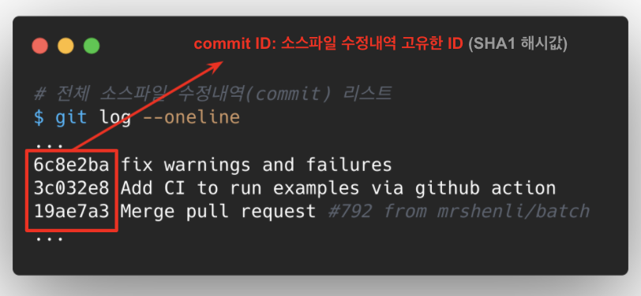
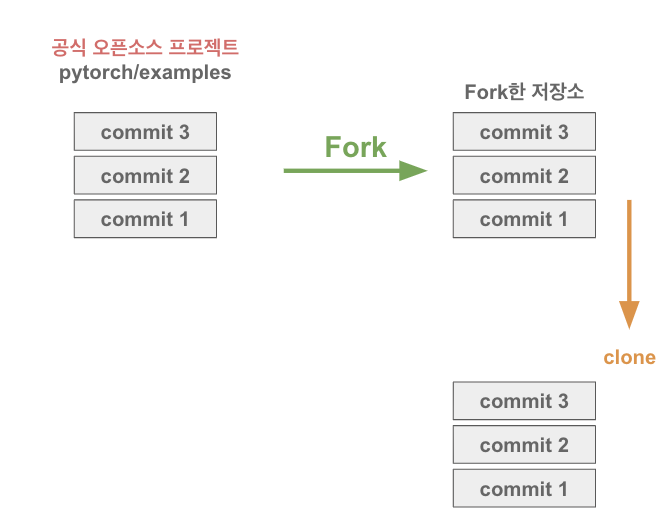
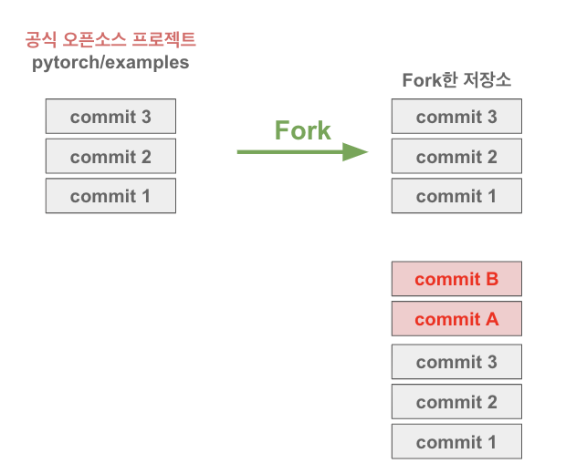
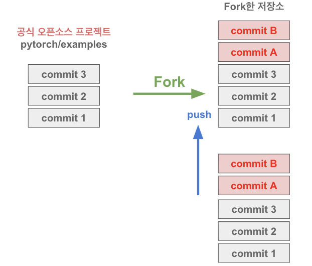
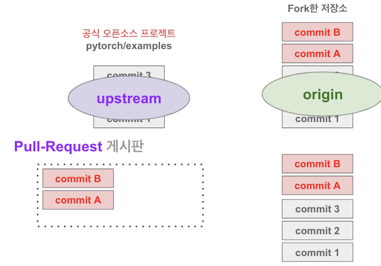
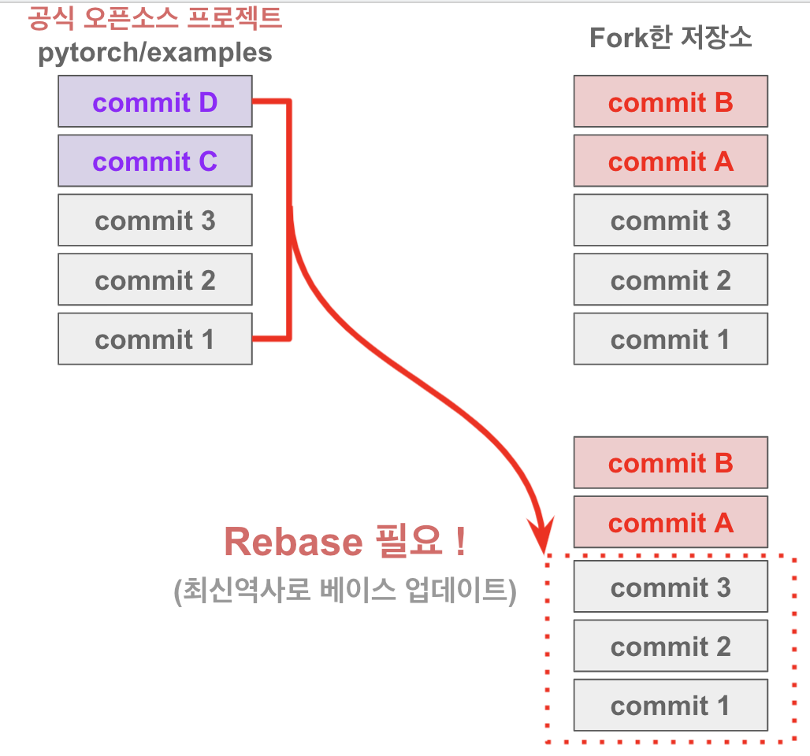

오픈소스 컨트리뷰톤에 선발되어 dooboo-ui 라는 프로젝트에 참여하게 되었다. 본격적인 오픈소스 컨트리뷰션을 시작하기 전에 사전 기본교육을 Git/Github 교육을 수강하게 되었다.


## 개발자가 오픈소스를 읽는 방법

### Fork & Clone
- fork 라는건 프로젝트를(commit 들을) 복사하는 것
- fork는 깃허브 웹사이트 안에서만 벌어지는 일  
- 나의 이름으로 된 계정 프로젝트로 복사해옴
- git clone은 프로젝트를 다운로드 받는 일
- 히스토리를 함께 받긴 하지만 소스코드를 함께 받는 것
- 소스코드를 받아야 개발을 할 수 있으니 클론일 필요하다.

### 해당 오픈소스에서 "누가 제일 개발을 많이 할까 ?"
`git shortlog -sn | nl` 
- nl 명령은 파일의 line number 명시 (순위 표시용으로 사용)   
- git shortlog -s 옵션이란? "개발자별 commit 갯수 요약"    
- git shortlog -n 옵션이란? "개발자별 commit 갯수 순위 정리"  


`git log --oneline | wc -l`
- 전체 소스파일 수정내역(commit) 개수 세기  
- wc -l 명령은 (파일) 라인수 개수 측정  

`git log --oneline`
- 전체 소스파일 수정내역(commit) 리스트   


`git show 6c8e2ba`
- 소스수정 내역(commit) 한가지 확인하기  

`git show 6c8e2ba | grep "diff --git"`
```bash  
$ git show 6c8e2ba | grep "diff --git"
diff --git a/dcgan/main.py b/dcgan/main.py
diff --git a/fast_neural_style/download_saved_models.py b/fast_neural_style/download_saved_models.py  
diff --git a/run_python_examples.sh b/run_python_examples.sh
diff --git a/word_language_model/main.py b/word_language_model/main.py
```
- 수정한 소스 파일의 갯수 찾아보기?!  
- 해당 commit(6c8e2ba)의 수정한 파일들 확인하기  

`git show 6c8e2ba | grep "diff --git" | wc -l`  
- 해당 commit의 수정한 파일 개수 확인

`943af71 Merge pull request #136 from gentlelinuxer/master`
- 위 처럼 나오는것은 수정내역은 없는 Merge commit

`git log -p`
- 전체 소스파일 수정내역(commit) 자세히 보기  
난 단순하게 커밋 한개를 제목만 보고 싶다 => `git log --oneline`  
세밀하게 보고 싶다. => `git log -p`


`git shortlog -sn -- mnist/`
- 특정 폴더를 기준으로 소스 수정내역(commit) 리스트 확인하기  
이것을 통해 누가 리뷰를 해줄 수 있는지 파악  
내가 작업하려고 하는 폴더, 작업한 폴더, 의 메인 개발자를 뽑아내면 그사람에게 물어볼 수 있다.  

`git log --oneline --after=2020-01-01 --before=2020-06-30`
- 2020년 1월 부터 2020년 6월 30일까지 소스 수정내역(commit) 리스트 확인  

`git log --oneline --after=2020-06-01 --before=2020-06-30 -- mnist/`
```bash
$ git log --oneline --after=2020-06-01 --before=2020-06-30 -- mnist/  
59423c5 Delete unnecessary blank lines (#785)
```
- 2020년 6월 한달간 mnist/ 폴더기준 소스파일 수정내역(commit) 확인하기


`git log --reverse`
- 소스파일 수정내역(commit) 옛날것부터 살펴보기  

>커밋 시 첫 단어 초이스를 잘하는게 좋다. FIX, Update 등

## 오픈소스 개발 참여 준비 Git 설정

- 브랜치 명을 만들때는 내가 작업하는 것 기준으로 한다.
- 브랜치란? 같은 폴더 다른세상
- Untracked file => git 프로젝트에서 관리 되지 않는 범위 밖에 있는 파일

### git add [작업파일] 해주면
- git diff에는 안나온다.
- 작업파일이 스테이징 되어 컨트롤 범위에 들어왔기 때문에  
- 수정내역(commit) 만들기 전 준비작업

> fork를 떠서 나만의 레포지토리를 유지를 해줘야 내가 작업한 내용들도 안전하게 백업/저장할 수 있다.

`git diff`  
- 파일 수정분에 대한 정보 확인 가능
- 최신역사와의 차이점 확인하기
- space 도 확인이 가능하여 실수를 방지할 수 있다.

`git stash`  
- 코드를 잠시 저장하는 기능
- 예) 버그 픽스 한 경우 원래의 소스와 수정된 소스와 비교를 한번 해보고 싶을때 유용
- before, after 비교

`git checkout -- mnist/main.py`  
- 특정 파일에 문제가 있어서 특정 파일만 롤백을 하고 싶다.
- 파일 수정한 내용 최신역사를 기준으로 복구하기
- checkout 의미 local git 저장소 에서 "가져오다 / 대출받다" 의미


### 공식 오픈소스 프로젝트를 내 계정에 fork 하여 clone


### clone 한 저장소에서 오픈소스 개발 후 커밋


### 커밋 후 푸쉬 하여 fork 한 내 원격 저장소에 해당 커밋 개발 작업이 쌓임


### fork 한 원격 저장소에서 Pull Request를 요청


### 공식 오픈소스 프로젝트가 upstream, fork한 내 원격 저장소가 origin


`git reset`  
- commit을 준비하는 add 명령 취소하기 (reset)

`git reset --hard HEAD~1`
- commit 정보 삭제하기
- 참고: HEAD~1 은 가장 위에서 첫번째 내용을 삭제한다는 의미  

`git commit --amend`
- 최신 commit 수정하기

### 원격 저장소에 새로운 commit이 반영되었으면 rebase가 필요


### 공식 upstream 저장소에서 최신 commit history 가져오기    
`$ git fetch upstream master`

### 최신 commit history 기준으로 베이스 갱신 (rebase)
`$ git rebase upstream/master`

### Fork 한 저장소(GitHub)도 수정하기 (PR 자동 갱신) 
`$ git push --force origin fix-mnist`

### 수정내역(commit) 과거 시점으로 되감기(rewind)
`$ git rebase -i --root`

### 수정내역(commit) 다시 현재 시점으로 풀기(continue)
`$ git rebase --continue`

### uftrace 버전 리스트 (태그) 가져오기
`$ git fetch --tags`

### uftrace 버전 확인
`$ git tag`

### 해당 소스파일을 누가 수정했고 언제 수정했는지 확인
- 소스 라인 기준으로 commit 정보를 찾아 낼 수 있다.  
`$ git blame cmds/record.c`
