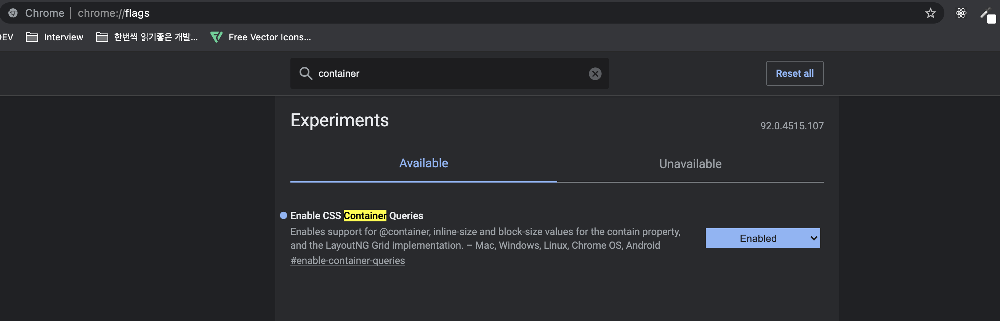
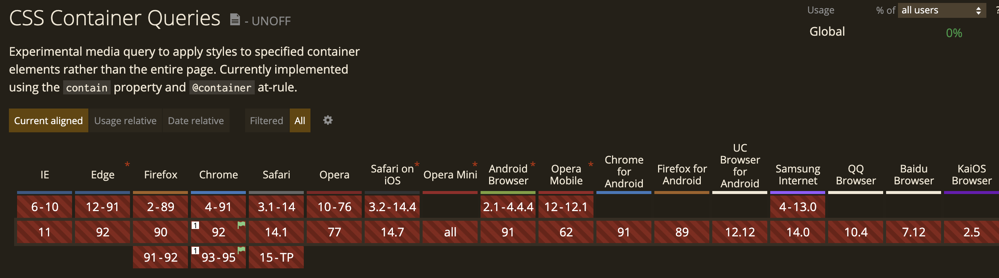

이번에 프로그래머스를 통해 FE 취업 생존키트라는 스터디에 참여하게 되었다.  
크게 이직 준비를 하는건 아니지만, 요즘같이 다양한 프레임워크와 라이브러리 등 개발을 편리하게 할 수 있게 해주는
너무나 좋은 도구들이 많기 때문에 본질/기본을 잊을 수 있겠다는 생각을 갖고 있었다.  
추후에 내 커리어를 위해서든 역량 향상을 위해서든 기본은 잊지 말아야 개발할때 도움이 된다고 생각하기 때문에
마침 프레임워크나 라이브러리를 쓰지 않고 Javascript 본질의 충실할 수 있는 스터디 기회가 생겨 참여하게 되었다.  
앞으로 매주 수업 세션 후 느낀점/배운점을 기록해보려고 한다.  

## 선언형 프로그래밍이란?

규칙에 기반하여 input과 output에 집중해서 프로그래밍 하는 방법이다.

명령형
- input이 주어졌을 때에 정해진 output이 존재하는 것이 아니라 특정 task를 실행한다.  
  ex) `export const ExecuteSomeTask = () => console.log('hello world');`
- 항상 똑같은 output을 보장하지 않는다.

선언형 
- input이 주어지면 어떤 output이 나올지 예상할 수 있다.  
  ex) `export const toLowerCase = (input) => input.toLowerCase();`
- 똑같은 input에 대해서는 항상 똑같은 output을 보장한다.

## 선언형 프로그래밍 in UI Development

UI 개발도 선언형 프로그래밍 방식으로 작성하면 훨씬 더 수월하게 작성할 수 있다고 한다.  
선언형으로 작성하게 되면 함수안은 어떻게 구현되어 있는지, 이 함수는 무슨일을 하는지 등을 생각하지 않아도 되는데  
명령형 프로그래밍 방식으로 작성하게 되면 함수를 사용하는데 생각을 더 하게 되고 또 코드 규모가 커지면 더 파악하기가 어려워지는 일이 발생한다.

## 선언형 vs 명령형 예제

### 명령형
```javascript
export default () => {
   const container = document.getElementById('app');
   const countdownContainer = document.createElement('div');
   countdownContainer.classList.add('countdown-container');
   container.appendChild(countdownContainer);

   const titleElement = document.createElement('div');
   titleElement.classList.add('title');
   titleElement.innerHTML = '남은 시간';
   countdownContainer.appendChild(titleElement);
   
   // ...
   // ...
   // ...
}
```
위 코드의 특징은 정해진 규칙 안에서 UI를 그리고 컴포넌트화 시키는 코드를 작성하기보다는 수행이 필요한 작업들을 순차적으로 진행한다.  

### 선언형
```javascript
// Component라는 Class를 정의하여 UI 개발의 규칙을 만들고
// 하나하나 직접 과정들을 명령하는 것이 아니고 Component를 선언하고
// render, state만을 컨트롤하고 UI를 그리는 것은 Component의 규칙에 따른다.
export default () => {
   class Component {
      constructor({ $target, as = 'div', initialState = {}, ...props }) {
         this.$target = $target;
         this.$element = document.createElement(as);
         this.props = props || {};
         this.state = initialState;
         this.render();
      }

      renderComponent() {
         // ...
      }

      setState(partialState) {
         this.state = { ...this.state, ...partialState };
         this.render();
      }

      updateDOM() {
         // ...
      }
   }
}
```
위 코드의 특징은 Component라는 클래스를 만들어서 그 안에서 정해진 규칙(contructor, renderComponent, setState 등)을 만들고 그 규칙에 따라 컴포넌트를 그리는 개발을 한다.

## 반응형 웹 구현하기

### 모바일 퍼스트
- 모바일이 더 디바이스의 리소스가 적기 때문에 모바일에서 최소한의 source를 해석하도록 해줄 수록 미약할 수 있지만 퍼포먼스에 도움이 된다.

### media query 사용하기
- window width에 따라서 responsive한 css 추가

### container query 맛보기 (experimental)
- container width에 따라서 responsive한 css 추가. 아직 chrome 최신버전에서만 지원하지만 미리 살펴볼 가치는 있다.

### 미디어 쿼리 예제

```css
@media (min-width: 350px) {
  .input-group {
    display: flex;
    align-items: center;
    gap: 1.5rem;
  }
}
```
위와 같이 media 쿼리를 활용하여 작성

### Container 쿼리 예제
먼저 크롬에서 chrome://flags 에 접속하여 검색창에 container라고 검색 후 Enable CSS Container Queries 항목을 Enabled 해줘야 하는 세팅이 필요하다.  



```css
@container (min-width: 700px){
  .card {
    display: grid;
    grid-template-columns: 2fr 1fr;
  }
}
```
parent 기준의 size에 따라 style을 지정할 수 있다.
사용처에 따라서 직접 구별할 수 있는 className 줘야하거나 javascript로 parent width를 체크하지 않는 이상
할 수 없던 일들을 @container query를 사용하면 해결할 수 있다.
그러나 container 쿼리는 현재 지원하는 브라우저가 거의 없어 아직 범용적으로 사용하기에는 이르다.



## 다크모드 대응하기 - 다크모드를 대응하는 여러가지 방법들

1) DOM property 활용하기(ex. body dataset 태그)
2) 두가지 light theme, dark theme stylesheet 활용하기
3) CSS Variables 활용하기  
 css variables를 활용하는 것이 따로 theme별 stylesheet를 유지하는 것보다 load해야할 코드가 적게 만들 수 있다.
4) 더 좋은 UX를 이루기 위한 방법  
시스템 preference를 기반으로 초기값 설정  
localStorage를 활용한 선호 초기값 저장
   
