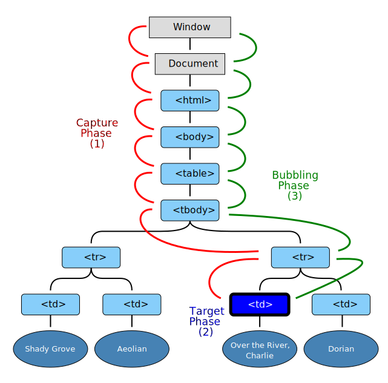

## 지난 과제 리뷰

keypress나 keydown, keyup 이벤트를 만들어 enter 키에 대한 처리를 하지 않고
form에 대한 기본적인 형식이 다 갖춰져 있지 않더라도
submit 이벤트는 기본적으로 enter와 바인딩이 되기 때문에 onsubmit 이벤트를 쓰는게 더 좋다.  
또한, 체크박스 만들때 input 과 label 을 id-for 로 서로 연결하여 만들면 더 코드를 간단히 작성할 수 있다.  

```javascript
<input type="checkbox" id="label-input-1" />
<label for="label-input-1">label</label>
```

## Sementic HTML - 의미론적으로 HTML을 작성하기!

Sementic HTML을 사용해야 하는 이유
1. 검색엔진이 웹사이트를 이해할 때에 참고할 수 있다.
2. 코드 작성자 입장에서 구조를 생각할 때에 앱의 구조를 설계할 때에 도움이 된다.

예를 들어, div 태그를 사용하여 id로 container, nav, footer 등을 명시해 넣는것보다 만들어져 있는 sementic tag를 활용하는게 더 좋다.

```html
<header>
  Header
  <nav></nav>
</header>
<main>
  <section>
    
  </section>
</main>
```

## 브라우저 이벤트의 흐름
브라우저에서 이벤트는 특정 액션이 일어났다는 의미

이벤트의 종류  
- 마우스 이벤트, 폼 이벤트, 키보드 이벤트 등    
이벤트 등록하는 법  
- HTML 속성, DOM 프로퍼티, addEventListner / removeEventListner  
이벤트 객체 살펴보기
- event.type, event.target, event.currentTarget

## 이벤트 버블링과 캡쳐링
1. 캡처링  
document에서 event.target까지 도달하는 이벤트의 흐름 
2. 타깃 도달
이벤트가 실제 타깃 요소에 전달되는 단계
3. 버블링
이벤트가 발생한 DOM 요소에서 최상단의 document까지 버블링하는 흐름  
브라우저 이벤트는 특별한 설정이 있지 않는 한 기본적으로 bubbling 으로 실행된다.


출처 : [버블링과 캡처링](https://ko.javascript.info/bubbling-and-capturing)

## 이벤트 위임
내부에 하나의 돔에 이벤트를 연결할 수 있는 방법을 이벤트 위임
```javascript
<nav onclick="menuClick(event)">FORM
  <ul>
    <li>
      <a>MENU 1</a>
    </li>
    <li>
      <a>MENU 2</a>
    </li>
    <li>
      <a>MENU 3</a>
    </li>
  </ul>
</nav>
```

## Infinite Scroll Pagination
이제는 page 클릭으로 pagination 을 하기보다는 infinite scroll pagination 으로 하는 방법이 추세  
intersectionObserver API를 사용해서 Infinite Scroll Pagination을 구현할 수 있다.  

intersectionObserver는 특정 DOM이 viewport안에 노출이 되기 시작하는 시점에 callback을 실행히셔주는 Web API.

## 브라우저 fetch 기초
Web API fetch를 사용하는 방법을 알아보기 전에 REST API에서 주로 사용되는 HTTP Method들을 알아볼 필요가 있다.  

주요 HTTP Method 종류 (For REST API, CRUD)
1) POST: 데이터를 생성 (Create)

2) PUT: 데이터를 업데이트 (Update)

3) PATCH: 데이터의 일부를 업데이트 (Update)

4) DELETE: 데이터를 삭제 (Delete)

5) GET: 데이터를 가져오기 (Read)

6) OPTIONS: 서버에서 지원하는 method를 확인 (동일 도메인이 아닌 다른 도메인으로 요청을 보낼 경우 OPTIONS을 먼저 보내서 사용한 가능한 method를 미리 browser가 확인한다.)
